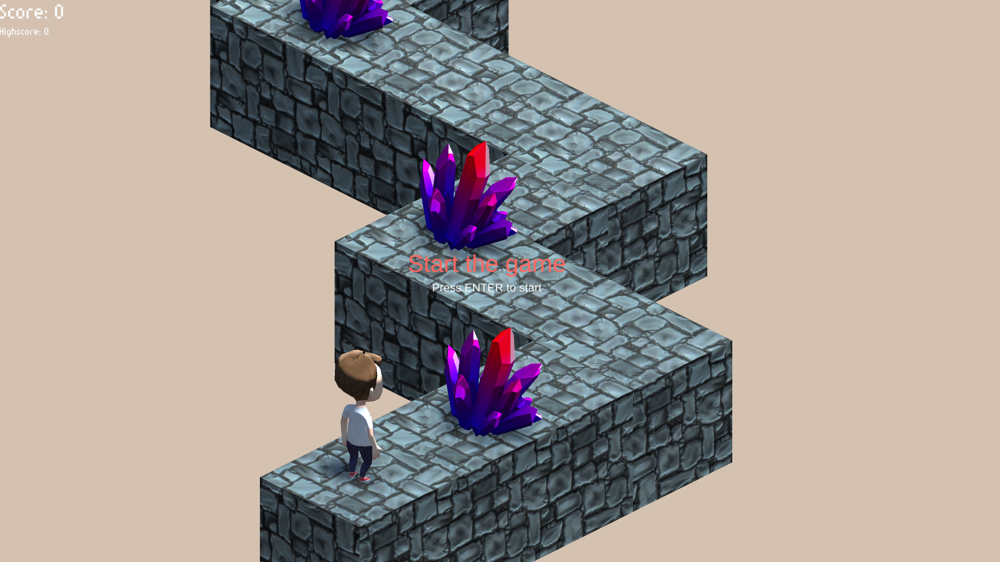
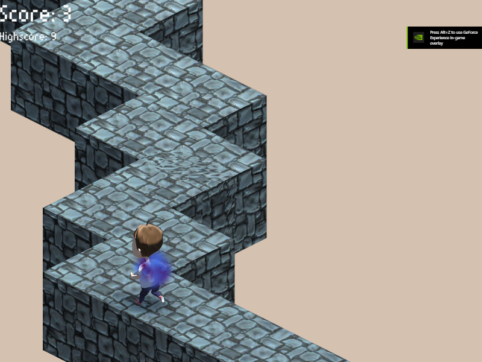

<!-- GAME PROJECT TITLE -->
# Zig-Zag---Game
Game created for study purposes by Matheus Soares Martins, and is based off in the original
ZigZag App that was made by Ketchapp.
It is a reflex-based puzzle game that encourages players to work through levels of increasing
difficulty. Redirecting the ball left and right, as it navigates through a zigzagged path.
For more information about the original game check:
https://childrenandmedia.org.au/app-reviews/apps/zigzag
 

This game was made to be played by one player, and there is just two controls for playing the game.
 

Game Controls 
-Player controls: 
Space - Turn left or right. (Opposite of the actual direction) 
ENTER - Starts the game in the beginning or after game over. 

-Other controls: 
Esc - Closes the game 
F11 - Toggle between fullscreen and windowed mode. 
******************************************************************************

 

# Screenshots
<!-- GAME PROJECT IMAGES -->

# <!-- GAME PROJECT BUILDS -->
# Game download
## Windows: https://mega.nz/folder/RNUVVKpY#mezP3A_UuvAdVngSdW9HDw
## Mac: https://mega.nz/folder/lAcXiT7Z#zqGNe4kNIl89kQZx6fP7WQ
## Linux: https://mega.nz/folder/BVd0lQaL#2Nf15Vce6m1ckY6ON_0mJw
